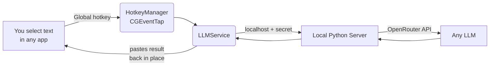

# ImpressionistLLM

**An invisible AI layer that sits on top of every app on your Mac.**

Select text anywhere, hit a hotkey, and the rewritten / answered / analyzed result is pasted back in place — without ever leaving the window you're in. No copy-pasting into a chat tab. No window switching. No "open the AI app" friction. The model meets you where you already work: your EHR, your editor, your inbox, your browser.

ImpressionistLLM is a native macOS menu-bar app (Swift + AppKit) backed by a tiny local Python server that proxies to [OpenRouter](https://openrouter.ai), so you can route any prompt to any model — GPT, Claude, Gemini, and hundreds more — from one place.

---

## Why an *invisible* wrapper?

Most AI tools make you go *to* them: switch to a browser tab, paste your text, copy the answer, switch back, paste again. That context-switch tax is paid hundreds of times a day. ImpressionistLLM inverts it.

| The usual way | ImpressionistLLM |
| --- | --- |
| Switch to ChatGPT tab | Stay in the app you're already using |
| Paste your text + a prompt | Select text, press one hotkey |
| Wait, copy the answer | Result is pasted back in place automatically |
| Switch back, paste | You never left |
| One model, one vendor | Any model on OpenRouter, per-prompt |

It works **on top of everything** — radiology dictation systems, VS Code, Notes, Mail, Slack, Word, a PDF viewer, a terminal — because it operates at the OS level (global hotkeys + the clipboard + the accessibility API), not as a plugin for any single app.

---

## Key benefits

- **Zero context switching.** Your hands never leave the keyboard and your eyes never leave the document. Select → hotkey → done.
- **Works in any app.** No integrations to install. If you can select text in it, ImpressionistLLM can act on it.
- **One hotkey per prompt.** Bind your most-used prompts (rewrite, summarize, fix grammar, translate, draft a reply, restructure a report) to their own shortcuts. A fuzzy-search floating menu (default: <kbd>`</kbd> backtick) lists everything else.
- **Any model, per prompt.** Each prompt declares its own model on line 1, so you can send quick edits to a fast cheap model and hard reasoning to a frontier one.
- **Vision built in.** Press the screenshot hotkey, drag a box across *any* part of *any* screen (multi-monitor aware), and the captured image is analyzed by a vision model — great for charts, scanned docs, error dialogs, or UI you can't select.
- **Rolling context.** Stack several selections into a shared context buffer that's injected into your next prompt, then auto-expires after 5 minutes so it never leaks into unrelated requests.
- **Edit-before-paste & chat mode.** Prompts can open a review/edit window before pasting, or spin up a full in-app chat session for back-and-forth.
- **Local-first & private.** The Python server runs on `127.0.0.1` behind a per-session secret. Your API key lives only on your machine. Provider routing defaults refuse providers that train on your prompts (configurable for PHI / Zero-Data-Retention).
- **Invisible UI.** A menu-bar icon, a translucent processing HUD, and overlay windows that render at screen-saver level — nothing steals focus from your real work.

---

## How it works



1. A global **event tap** intercepts your hotkey no matter which app is focused.
2. The selected text is grabbed via the clipboard, wrapped with the prompt's system instructions (and any active context), and sent to the **local Python server**.
3. The server proxies to **OpenRouter** using the model the prompt requested.
4. The response is **pasted back** into the original app — or opened in an edit window / chat session, depending on the prompt's settings.

See [`docs/ARCHITECTURE.md`](docs/ARCHITECTURE.md) for the full breakdown.

---

## Quick start

> Requires macOS, the Xcode command-line tools (for `swiftc`), and a system `python3`.

1. **Get an OpenRouter API key** at <https://openrouter.ai/keys>.
2. **Add your key.** Copy the template and drop your key in:
   ```bash
   cp config/settings.ini.example config/settings.ini
   # then edit config/settings.ini and set APIKey=sk-or-v1-...
   ```
   (Or export `OPENROUTER_API_KEY` in your shell — it takes priority.)
3. **Build the app:**
   ```bash
   ./build_app.sh
   ```
4. **Launch it:**
   ```bash
   open ImpressionistLLM.app
   ```
   On first run it bootstraps a local Python virtualenv (~15s) and shows a splash screen.
5. **Grant Accessibility permission** when prompted (System Settings → Privacy & Security → Accessibility). This lets the app read your selection and paste results.

Now select some text in any app and press <kbd>`</kbd> to open the floating prompt menu.

---

## Default hotkeys

| Action | Default shortcut | What it does |
| --- | --- | --- |
| Floating prompt menu | <kbd>`</kbd> (backtick) | Fuzzy-search and run any prompt |
| Screenshot → vision | <kbd>⌃</kbd>+<kbd>G</kbd> | Drag a box on any screen; analyze with a vision model |
| Cancel | configurable | Abort the in-flight request |
| Clear context | configurable | Empty the rolling context buffer |
| Open context manager | configurable | Manage stacked context in a web view |

All shortcuts are remappable in the in-app **Hotkey Settings** window, and per-prompt hotkeys can be assigned to any prompt.

---

## Customizing prompts

Prompts are plain `.txt` files in [`prompts/`](prompts/). The first line is the model ID, then a blank line, then the system prompt:

```text
openai/gpt-5.5

Rewrite the selected text to be clear and concise. Preserve meaning.
```

Add a file, give it a hotkey in settings, and it's live. The bundled prompts skew toward radiology reporting (the project's origin) but the mechanism is fully general — see [`prompts/README.md`](prompts/README.md) for the format and optional metadata.

---

## Documentation

| Doc | Contents |
| --- | --- |
| [`docs/ARCHITECTURE.md`](docs/ARCHITECTURE.md) | Runtime architecture, system layers, data boundaries |
| [`docs/OPERATIONS.md`](docs/OPERATIONS.md) | Building, launching, logs, Python bootstrap, code-signing |
| [`docs/REPO_STRUCTURE.md`](docs/REPO_STRUCTURE.md) | File-by-file layout and component roles |
| [`prompts/README.md`](prompts/README.md) | Prompt file format and authoring |
| [`config/README.md`](config/README.md) | Configuration reference |

---

## Project layout

```text
.
├── *.swift                  # Native macOS app (menu bar, hotkeys, overlays, HUD)
├── build_app.sh             # Compiles, bundles, and code-signs ImpressionistLLM.app
├── config/                  # settings.ini.example, hotkey bindings (your key stays local)
├── lib/core/                # Local Python server + OpenRouter client
├── prompts/                 # Your prompt library (.txt) + prompt-manager web assets
├── scripts/                 # Model probes and validation helpers
└── docs/                    # Architecture, operations, structure
```

---

## Privacy & security

- **Your API key never leaves your machine.** It lives in `config/settings.ini` (git-ignored) or an env var.
- **The local server binds to `127.0.0.1`** and requires a per-session `X-API-Secret` header — other processes can't talk to it.
- **Provider routing** defaults to refusing providers that train on prompts. For PHI, flip on Zero-Data-Retention mode in `config/settings.ini` (`ProviderZDR=true`).
- **Secrets are git-ignored.** `config/settings.ini`, `cert/*.key`, `cert/*.p12`, `.env`, and `logs/` are excluded by [`.gitignore`](.gitignore). Never commit real keys.
