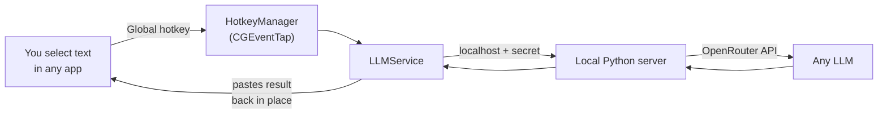

<div align="center">


# ImpressionistLLM (aka ImpressionismLLM)

### An invisible AI layer that sits on top of every app on your Mac

Select text anywhere &rarr; press a hotkey &rarr; the result is pasted back in place.
<br/>No tab switching. No copy paste dance. The model comes to you.

<br/>


&nbsp;
&nbsp;
&nbsp;
&nbsp;
&nbsp;

<br/>

**[Features](#features)** &nbsp;&middot;&nbsp; **[How it works](#how-it-works)** &nbsp;&middot;&nbsp; **[Quick start](#quick-start)** &nbsp;&middot;&nbsp; **[Hotkeys](#hotkeys)** &nbsp;&middot;&nbsp; **[Docs](#documentation)** &nbsp;&middot;&nbsp; **[License](#license)**

</div>

<hr/>

ImpressionistLLM is a native macOS menu&#8209;bar app that turns **any** application into an AI&#8209;powered one. It runs at the OS level (global hotkeys, the clipboard, and the accessibility API), so it works inside your EHR, editor, inbox, browser, or terminal without a single plugin. A tiny local Python server proxies your requests to [OpenRouter](https://openrouter.ai), giving you GPT, Claude, Gemini, and hundreds of other models from one keystroke.

## Why invisible?

Every other AI tool makes you go *to* it. ImpressionistLLM comes *to you*. That difference is paid back hundreds of times a day.

<div align="center">

| The usual way | ImpressionistLLM |
| :-- | :-- |
| Switch to a ChatGPT tab | Stay in the app you are already in |
| Paste your text and a prompt | Select text, press one hotkey |
| Wait, then copy the answer | The answer is pasted back in place |
| Switch back, paste again | You never left |
| Locked to one vendor's model | Any model on OpenRouter, per prompt |

</div>

## Features

<table>
<tr>
<td width="50%" valign="top">

#### Zero context switching
Your hands stay on the keyboard and your eyes stay on the document.

</td>
<td width="50%" valign="top">

#### Works in any app
If you can select text in it, you can run a prompt on it. No integrations.

</td>
</tr>
<tr>
<td width="50%" valign="top">

#### One hotkey per prompt
Bind your go&#8209;to prompts to shortcuts. A fuzzy&#8209;search floating menu (<kbd>`</kbd>) holds the rest.

</td>
<td width="50%" valign="top">

#### Any model, per prompt
Each prompt names its own model, so cheap&#8209;and&#8209;fast and frontier reasoning coexist.

</td>
</tr>
<tr>
<td width="50%" valign="top">

#### Built&#8209;in vision
Drag a box across any screen (multi&#8209;monitor aware) and a vision model reads it: charts, scans, error dialogs, un&#8209;selectable UI.

</td>
<td width="50%" valign="top">

#### Rolling context
Stack multiple selections into a shared buffer that feeds your next prompt, then auto&#8209;expires after 5 minutes.

</td>
</tr>
<tr>
<td width="50%" valign="top">

#### Edit before paste and chat mode
Review output before it lands, or open a full in&#8209;app chat session.

</td>
<td width="50%" valign="top">

#### Local first and private
The server binds to `127.0.0.1` behind a per&#8209;session secret. Your API key never leaves the machine.

</td>
</tr>
</table>

## How it works



1. A global **event tap** catches your hotkey regardless of the focused app.
2. The selection is captured, wrapped with the prompt's system instructions (plus any active context), and sent to the **local server**.
3. The server proxies to **OpenRouter** using the model the prompt requested.
4. The response is **pasted back** in place, or opened in an edit window or chat session, depending on the prompt's settings.

Full breakdown in [`docs/ARCHITECTURE.md`](docs/ARCHITECTURE.md).

## Quick start

> **Requires** macOS, Xcode command&#8209;line tools (`swiftc`), and a system `python3`.

#### 1. Get an OpenRouter API key

ImpressionistLLM sends every request through [OpenRouter](https://openrouter.ai), a single gateway to GPT, Claude, Gemini, and hundreds of other models. One key unlocks every model a prompt can name, so you never sign up with each vendor separately.

1. Create a free account at **[openrouter.ai/keys](https://openrouter.ai/keys)**.
2. Click **Create Key** and copy it. The key looks like `sk-or-v1-...`.

#### 2. Add your key

The repo ships with [`config/settings.ini`](config/settings.ini) ready to go. Open it and replace the placeholder with the key you just copied:

```ini
[API]
APIKey=YOUR_API_KEY_HERE      ; <-- paste your sk-or-v1-... key here
DefaultModel=openai/gpt-5.5
```

Prefer not to edit the file? Export the key instead, which takes priority:

```bash
export OPENROUTER_API_KEY=sk-or-v1-your-key
```

#### 3. Build and launch

```bash
./build_app.sh              # compiles, bundles, and code-signs the app
open ImpressionistLLM.app   # first run bootstraps a local Python venv, about 15s
```

#### 4. Grant permission and go

Grant **Accessibility** permission when prompted (System Settings &rarr; Privacy &amp; Security &rarr; Accessibility) so the app can read your selection and paste results. Then select text in any app and press <kbd>`</kbd>.

> **Note for contributors:** the committed `config/settings.ini` contains only a placeholder. Never commit a real key. To keep your local key from being staged, run `git update-index --skip-worktree config/settings.ini`.

## Hotkeys

<div align="center">

| Action | Default | What it does |
| :-- | :--: | :-- |
| Floating prompt menu | <kbd>`</kbd> | Fuzzy&#8209;search and run any prompt |
| Screenshot to vision | <kbd>⌃</kbd><kbd>G</kbd> | Drag a box on any screen, analyze with a vision model |
| Cancel | configurable | Abort the in&#8209;flight request |
| Clear context | configurable | Empty the rolling context buffer |
| Context manager | configurable | Manage stacked context in a web view |

</div>

Everything is remappable in the in&#8209;app **Hotkey Settings** window, including a dedicated shortcut per prompt.

## Writing prompts

Prompts are plain `.txt` files in [`prompts/`](prompts/). Line 1 is the model ID, then a blank line, then the system prompt:

```text
openai/gpt-5.5

Rewrite the selected text to be clear and concise. Preserve meaning.
```

Drop in a file, assign a hotkey, and it is live. The bundled prompts lean toward radiology reporting (the project's origin), but the mechanism is fully general. See [`prompts/README.md`](prompts/README.md).

## Privacy &amp; security

- **Your key stays local.** `config/settings.ini` ships with a placeholder only. Your real key lives on your machine and is never sent anywhere except OpenRouter.
- **The server is loopback only.** It is bound to `127.0.0.1` and gated by a per&#8209;session `X-API-Secret` header.
- **Routing refuses training providers** by default. Enable Zero&#8209;Data&#8209;Retention (`ProviderZDR=true`) for PHI workloads.
- **Secrets are git&#8209;ignored.** `cert/*.key`, `cert/*.p12`, `.env`, and `logs/` are excluded by [`.gitignore`](.gitignore). The committed `config/settings.ini` carries a placeholder key, never a real one.

## Documentation

| Doc | Contents |
| :-- | :-- |
| [`docs/ARCHITECTURE.md`](docs/ARCHITECTURE.md) | Runtime architecture, system layers, data boundaries |
| [`docs/OPERATIONS.md`](docs/OPERATIONS.md) | Building, launching, logs, Python bootstrap, code signing |
| [`docs/REPO_STRUCTURE.md`](docs/REPO_STRUCTURE.md) | File by file layout and component roles |
| [`prompts/README.md`](prompts/README.md) | Prompt file format and authoring |
| [`config/README.md`](config/README.md) | Configuration reference |

## Project layout

```text
.
├── Sources/         # Native macOS app
│   ├── App/         #   lifecycle, shared state, theming
│   ├── Services/    #   hotkeys, clipboard, Python daemon, OpenRouter flow
│   └── UI/          #   menu bar, floating menu, overlays, HUD, editors
├── build_app.sh     # Compiles, bundles, and code-signs ImpressionistLLM.app
├── config/          # settings.ini.example + hotkey bindings (your key stays local)
├── lib/core/        # Local Python server + OpenRouter client
├── prompts/         # Your prompt library (.txt) + prompt-manager web assets
├── scripts/         # Model probes and validation helpers
└── docs/            # Architecture, operations, structure
```

> The compiled `.app` runs from the repo root and reads `config/`, `lib/core/`, `prompts/`, and `LoadingScreen.png` as siblings. Those stay put by design.

## License

Released under the [PolyForm Noncommercial License 1.0.0](LICENSE).

- **Free for noncommercial use.** Personal projects, study, and research are all welcome.
- **Collaboration is encouraged.** Contributions that help improve and scale the app are warmly received.
- **Commercial use needs a license.** Companies and for&#8209;profit products building on this should reach out first to arrange commercial terms.

For commercial licensing or partnership inquiries, contact **Andrew.Hatkoff@UHKC.org**.
