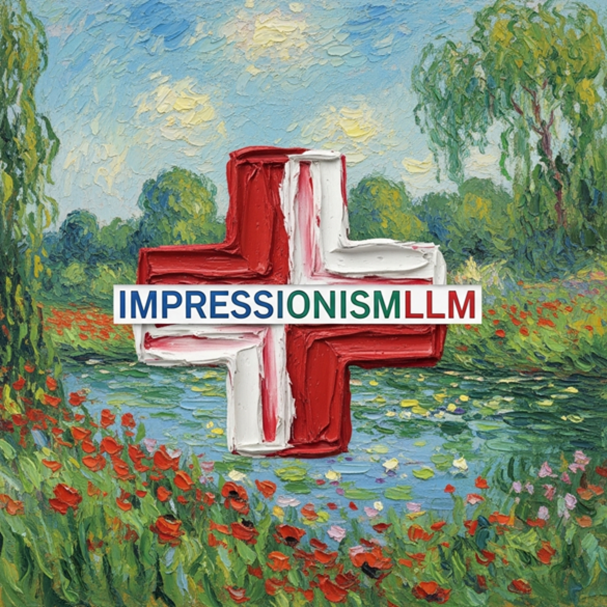
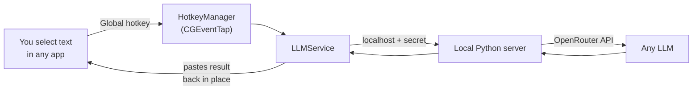

<div align="center">



# ImpressionistLLM

**An invisible AI layer that sits on top of every app on your Mac.**

Select text anywhere → press a hotkey → the result is pasted back in place.
No tab-switching. No copy-paste dance. The model comes to you.


</div>

---

ImpressionistLLM is a native macOS menu-bar app that turns **any** application into an AI-powered one. It runs at the OS level — global hotkeys, the clipboard, and the accessibility API — so it works inside your EHR, editor, inbox, browser, or terminal without a single plugin. A tiny local Python server proxies your requests to [OpenRouter](https://openrouter.ai), giving you GPT, Claude, Gemini, and hundreds of other models from one keystroke.

<details>
<summary><b>Table of contents</b></summary>

- [Why invisible?](#why-invisible)
- [Features](#features)
- [How it works](#how-it-works)
- [Quick start](#quick-start)
- [Hotkeys](#hotkeys)
- [Writing prompts](#writing-prompts)
- [Privacy &amp; security](#privacy--security)
- [Documentation](#documentation)
- [Project layout](#project-layout)
- [License](#license)

</details>

## Why invisible?

Every other AI tool makes you go *to* it. ImpressionistLLM comes *to you*. That difference is paid back hundreds of times a day.

| The usual way | ImpressionistLLM |
| --- | --- |
| Switch to a ChatGPT tab | Stay in the app you're already in |
| Paste your text and a prompt | Select text, press one hotkey |
| Wait, then copy the answer | The answer is pasted back in place |
| Switch back, paste again | You never left |
| Locked to one vendor's model | Any model on OpenRouter, per prompt |

## Features

- **Zero context switching** — hands stay on the keyboard, eyes stay on the document.
- **Works in any app** — if you can select text in it, you can run a prompt on it. No integrations.
- **One hotkey per prompt** — bind your go-to prompts to shortcuts; a fuzzy-search floating menu (<kbd>`</kbd>) holds the rest.
- **Any model, per prompt** — each prompt names its own model, so cheap-and-fast and frontier-reasoning coexist.
- **Built-in vision** — drag a box across any screen (multi-monitor aware) and a vision model reads it: charts, scans, error dialogs, un-selectable UI.
- **Rolling context** — stack multiple selections into a shared buffer that's injected into your next prompt, then auto-expires after 5 minutes.
- **Edit-before-paste & chat mode** — review output before it lands, or open a full in-app chat session.
- **Local-first & private** — server binds to `127.0.0.1` behind a per-session secret; your API key never leaves the machine.

## How it works



1. A global **event tap** catches your hotkey regardless of the focused app.
2. The selection is captured, wrapped with the prompt's system instructions (plus any active context), and sent to the **local server**.
3. The server proxies to **OpenRouter** using the model the prompt requested.
4. The response is **pasted back** in place — or opened in an edit window or chat session, per the prompt's settings.

Full breakdown in [`docs/ARCHITECTURE.md`](docs/ARCHITECTURE.md).

## Quick start

> **Requires** macOS, Xcode command-line tools (`swiftc`), and a system `python3`.

```bash
# 1. Add your OpenRouter key (get one at https://openrouter.ai/keys)
cp config/settings.ini.example config/settings.ini
#    then edit config/settings.ini → APIKey=sk-or-v1-...
#    (or export OPENROUTER_API_KEY — it takes priority)

# 2. Build
./build_app.sh

# 3. Launch (first run bootstraps a local Python venv, ~15s)
open ImpressionistLLM.app
```

Grant **Accessibility** permission when prompted (System Settings → Privacy & Security → Accessibility) so the app can read your selection and paste results. Then select text in any app and press <kbd>`</kbd>.

## Hotkeys

| Action | Default | What it does |
| --- | --- | --- |
| Floating prompt menu | <kbd>`</kbd> | Fuzzy-search and run any prompt |
| Screenshot → vision | <kbd>⌃</kbd><kbd>G</kbd> | Drag a box on any screen; analyze with a vision model |
| Cancel | configurable | Abort the in-flight request |
| Clear context | configurable | Empty the rolling context buffer |
| Context manager | configurable | Manage stacked context in a web view |

Everything is remappable in the in-app **Hotkey Settings** window, including a dedicated shortcut per prompt.

## Writing prompts

Prompts are plain `.txt` files in [`prompts/`](prompts/). Line 1 is the model ID, then a blank line, then the system prompt:

```text
openai/gpt-5.5

Rewrite the selected text to be clear and concise. Preserve meaning.
```

Drop in a file, assign a hotkey, and it's live. The bundled prompts lean toward radiology reporting (the project's origin), but the mechanism is fully general — see [`prompts/README.md`](prompts/README.md).

## Privacy & security

- **Your key stays local** — it lives in `config/settings.ini` (git-ignored) or an env var, never in the repo.
- **The server is loopback-only** — bound to `127.0.0.1` and gated by a per-session `X-API-Secret` header.
- **Routing refuses training providers** by default; enable Zero-Data-Retention (`ProviderZDR=true`) for PHI workloads.
- **Secrets are git-ignored** — `config/settings.ini`, `cert/*.key`, `cert/*.p12`, `.env`, and `logs/` are excluded by [`.gitignore`](.gitignore). Never commit a real key.

## Documentation

| Doc | Contents |
| --- | --- |
| [`docs/ARCHITECTURE.md`](docs/ARCHITECTURE.md) | Runtime architecture, system layers, data boundaries |
| [`docs/OPERATIONS.md`](docs/OPERATIONS.md) | Building, launching, logs, Python bootstrap, code-signing |
| [`docs/REPO_STRUCTURE.md`](docs/REPO_STRUCTURE.md) | File-by-file layout and component roles |
| [`prompts/README.md`](prompts/README.md) | Prompt file format and authoring |
| [`config/README.md`](config/README.md) | Configuration reference |

## Project layout

```text
.
├── Sources/         # Native macOS app
│   ├── App/         #   lifecycle, shared state, theming
│   ├── Services/    #   hotkeys, clipboard, Python daemon, OpenRouter flow
│   └── UI/          #   menu bar, floating menu, overlays, HUD, editors
├── build_app.sh     # Compiles, bundles, and code-signs ImpressionistLLM.app
├── config/          # settings.ini.example + hotkey bindings (your key stays local)
├── lib/core/        # Local Python server + OpenRouter client
├── prompts/         # Your prompt library (.txt) + prompt-manager web assets
├── scripts/         # Model probes and validation helpers
└── docs/            # Architecture, operations, structure
```

> The compiled `.app` runs from the repo root and reads `config/`, `lib/core/`, `prompts/`, and `LoadingScreen.png` as siblings — those stay put by design.

## License

Released under the [PolyForm Noncommercial License 1.0.0](LICENSE).

- **Free for noncommercial use** — personal projects, study, and research are all welcome.
- **Collaboration is encouraged** — contributions that help improve and scale the app are warmly received.
- **Commercial use needs a license** — companies and for-profit products building on this should reach out first to arrange commercial terms.

For commercial licensing or partnership inquiries, contact **Andrew.Hatkoff@UHKC.org**.
