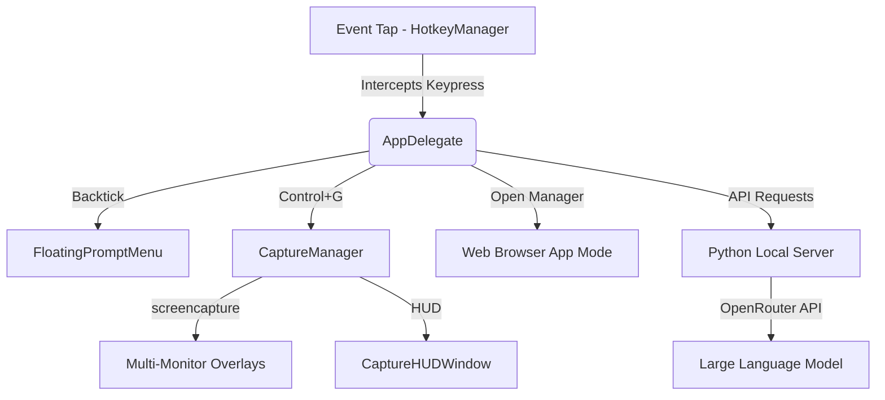

# Architecture

## Runtime Architecture

## System Layers

1. **Swift AppKit Controller (`AppDelegate.swift`)**: 
   Starts the application, displays the Crimson Red startup splash screen, spins up the Python background daemon, sets up the menu bar item, and delegates hotkey events.
2. **Unified Shortcut Routing (`HotkeyManager.swift`)**:
   Captures global keystrokes via `CGEventTap`, avoiding Carbon Hotkey limitations. Bypasses and forwards modifiers to overlay windows when active, while capturing fallback operations (like Escape aborts) natively.
3. **Multi-Monitor Screenshot Capture (`CaptureOverlay.swift`)**:
   Runs background `/usr/sbin/screencapture` threads concurrently per display to capture background pixels instantly. Spawns translucent full-screen cropping canvases overlayed with a SwiftUI `CaptureHUDWindow` at `.screenSaver` level.
4. **Python API Daemon (`http_server.py`)**:
   A lightweight HTTP service running inside a local `.venv` virtual environment on a customizable port. It manages local chat histories, debug logs, prompt CRUD files, and proxies requests to OpenRouter.
5. **Dynamic Actions Editor (`ScreenshotActionEditor.swift`)**:
   A Swift-native resizable configuration editor that updates `screenshot_actions.json` prompts, hotkeys, and model routes with inline validation.

## Data Boundaries

- `config/settings.ini`: Local user configuration (API key, default models, server ports).
- `prompts/processors/screenshot_actions.json`: Stores crop-specific labels, hotkeys, and instruction prompts.
- `logs/`: Application debug logs (`app_debug.log`, `server_startup.log`, and OpenRouter logs).
- `lib/core/.venv/`: Isolated virtualenv Python environment created and managed dynamically at first launch.
